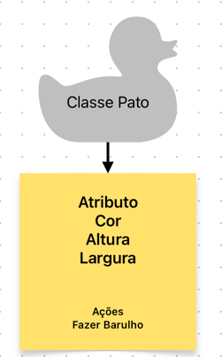
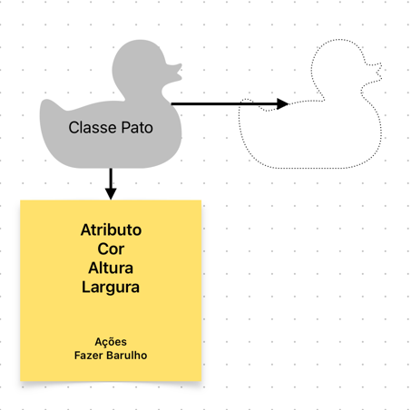
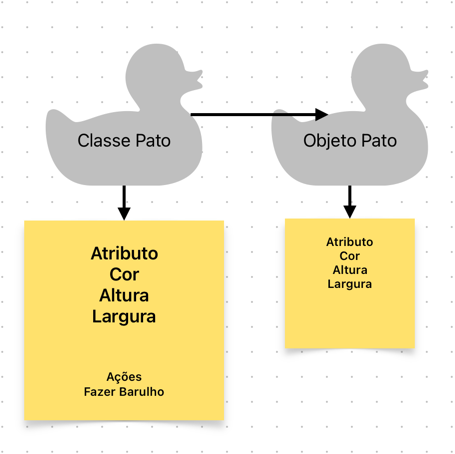
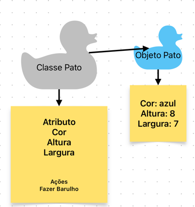
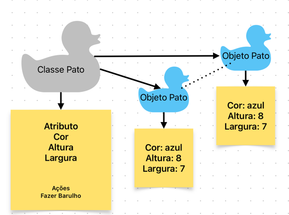

## Resumo da primeira aula:

### 1. criamos a classe Pato, representada na figura abaixo.



Segue o código da classe Pato:

```java
package org.example.lesson_01.models;

public class Pato {
    public String cor;
    public double altura;
    public double largura;
}
```

### 2. Na Classe ‘App’, declaramos um objeto da classe Pato, mas não a inicializamos.



```java
public class App 
{
    public static void main( String[] args )
    {
        Pato pato;
    }
}
```

O objeto pato é declarado, mas não inicializado. Isso significa que ele não aponta para nenhum endereço de memória.
E não iremos conseguir acessar nenhum atributo ou método da classe Pato.

### 3. Na Classe ‘App’, declaramos um objeto da classe Pato, e o inicializamos.



```java
public class App 
{
    public static void main( String[] args )
    {
        Pato pato = new Pato();
    }
}
```

O objeto pato é declarado e inicializado. Isso significa que ele aponta para um endereço de memória.
E podemos acessar os atributos e métodos da classe Pato.

### 4. Na Classe ‘App’, declaramos um objeto da classe Pato, e o inicializamos com valores.



```java
public class Pato {
    public String cor;
    public double altura;
    public double largura;

    public Pato(String cor, double altura, double largura) {
        this.cor = cor;
        this.altura = altura;
        this.largura = largura;
    }
}
```

Adicionamos um construtor na classe Pato, para podermos inicializar o objeto com valores.
Agora não é mais possível inicializar o objeto sem passar os valores para o construtor.

```java
public class App 
{
    public static void main( String[] args )
    {
        Pato pato = new Pato("azul", 8, 7);
    }
}
```

### 5. Se inicializarmos dois objetos com os mesmos valores, eles não serão o mesmo objeto.



```java
public class App 
{
    public static void main( String[] args )
    {
        Pato pato = new Pato("azul", 8, 7);
        Pato pato1 = new Pato("azul", 8, 7);

        System.out.println(pato.equals(pato1)); // FALSE
    }
}
```

