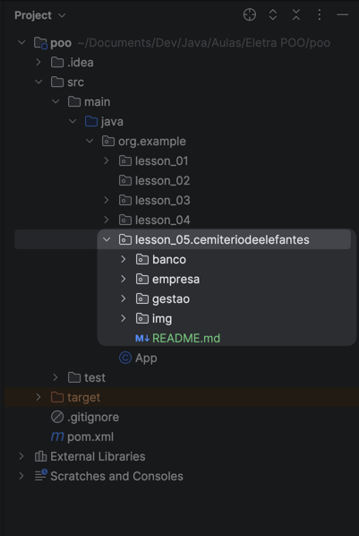

# O Cemitério de Elefantes

## Bem-vindo ao Cemitério dos Códigos: Uma Jornada pelo Lado Sombrio da Programação

No vasto reino da programação, existe um território inexplorado, marcado por advertências e sussurros entre os desenvolvedores. 
Inspirado pela mítica terra do "Cemitério dos Elefantes" de "O Rei Leão", este projeto é um compilado dos mais intrigantes 
anti-padrões e práticas questionáveis em Java. Assim como Simba foi advertido a nunca aventurar-se naquelas terras sombrias, 
os desenvolvedores são frequentemente aconselhados a evitar certos caminhos no desenvolvimento de software.

Ao explorar este repositório, você encontrará exemplos deliberadamente mal projetados, incluindo:

- Classes superdimensionadas que desafiam o princípio da responsabilidade única.
- Uso inadequado de herança, levando a uma rígida estrutura de código difícil de manter e estender.
- Exemplos de acoplamento apertado, onde as classes estão tão interligadas que mudar uma leva a uma cascata de mudanças em outras.
- Violações do encapsulamento, expondo detalhes internos das classes que deveriam permanecer ocultos.

Embora este repositório seja uma coleção de más práticas, ele é uma ferramenta valiosa para aprender a reconhecer e evitar.

## O que você deve fazer?
Refatorar todos os erros que encontrar e anotar o porque era uma má prática e o que foi feito para corrigir.

